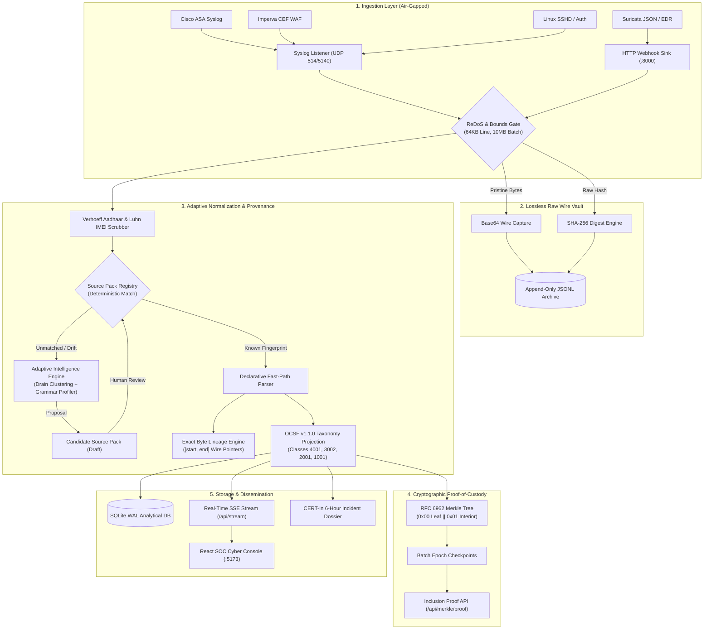

# AegisGuard-ULPF — System Architecture Specification (SIH 26156)
**National Technical Research Organisation (NTRO) · Sovereign Air-Gapped Cyber Security Telemetry Infrastructure**

---

## PAGE 1 — ARCHITECTURAL TOPOLOGY & DATAFLOW PIPELINE

### 1. High-Level Executive Summary
**AegisGuard-ULPF** is an air-gappable, sovereign security telemetry pre-processing framework designed for National Security Operations Centers (SOC) and Critical Information Infrastructures (CII). It solves the problem of ingestion chaos across heterogeneous perimeter appliances (firewalls, WAFs, EDRs, identity providers) by normalizing telemetry into **strictly pinned OCSF v1.1.0** records with **bit-exact wire-byte lineage** and **RFC 6962 cryptographic proof-of-custody**.



### 2. End-to-End Processing Stages
1. **Ingestion & Safety Gate:** Ingests via UDP syslog (`514/5140`) or HTTP webhook. ReDoS heuristics and memory watermarks protect worker threads.
2. **Lossless Wire Vault:** Unaltered wire bytes are hashed with SHA-256 and committed to `storage/lossless_archive.jsonl` prior to any string parsing.
3. **Adaptive Source Normalization:** Active Source Packs parse fields into OCSF targets. Unknown formats are quarantined, clustered, and drafted into candidate packs without service interruption.
4. **Cryptographic Proof-of-Custody:** Batch records are sealed in domain-separated RFC 6962 Merkle trees providing logarithmic inclusion proofs.
5. **Multi-Channel Dissemination:** Structured records populate SQLite WAL storage, CERT-In compliance dossiers, and real-time SOC web consoles.

---

## PAGE 2 — INTEGRITY MODEL, COMPLIANCE & SCALE-OUT ARCHITECTURE

### 3. Cryptographic Proof-of-Custody (RFC 6962)
AegisGuard-ULPF treats telemetry as legal and forensic evidence:
- **Leaf Hashing:** $\text{Hash}_{\text{leaf}} = \text{SHA-256}(0x00 \mathbin{\Vert} \text{raw\_payload})$
- **Interior Node Hashing:** $\text{Hash}_{\text{interior}} = \text{SHA-256}(0x01 \mathbin{\Vert} \text{left\_hash} \mathbin{\Vert} \text{right\_hash})$
- **Second-Preimage Resistance:** Domain separation prefixes (`0x00` and `0x01`) mathematically prevent interior nodes from being spoofed as leaf records.
- **Logarithmic Audit Proofs:** Verifiers can confirm that any individual event was included in a batch of $N$ logs with $\lceil \log_2 N \rceil$ sibling hashes via `GET /api/merkle/proof/{id}`.

### 4. Bit-Exact Byte Lineage
Every normalized attribute in the OCSF envelope contains an exact character coordinate span:
```json
"lineage": {
  "source_pack": "cisco_asa_firewall",
  "version": "1.0.0",
  "fields": {
    "src_ip": {"start": 63, "end": 75, "raw_token": "198.51.100.4", "confidence": 1.0},
    "action": {"start": 15, "end": 20, "raw_token": "Built", "confidence": 1.0}
  }
}
```
Any modification or offset slippage in the pipeline immediately trips the round-trip reconstruction gate (`backend/reconstruction_verifier.py`).

### 5. Sovereign Indian Statutory Compliance
- **Dihedral Group $D_5$ Aadhaar Scrubbing:** Uses the mathematical Verhoeff permutation algorithm. Prevents false-positive redaction of 12-digit timestamps and order IDs while scrubbing authentic Aadhaar numbers.
- **Income Tax PAN & Luhn IMEI:** Scans and masks PAN cards and Luhn-validated 15-digit IMEIs.
- **CERT-In 6-Hour Disclosure Export:** Generates structured JSON incident reporting packages complying with CERT-In directions under Section 70B of the IT Act.

### 6. Stateless Scale-Out Architecture
```
                         [ L4 Network Load Balancer / UDP Syslog Reflector ]
                                      │                        │
                      ┌───────────────┴────────┐      ┌────────┴───────────────┐
                      ▼                        ▼      ▼                        ▼
              [ Worker Node 1 ]        [ Worker Node 2 ]     [ Worker Node 3 ]  ...
              • Shared Read-Only Source Pack Volume (/sources)
              • Dedicated Local Worker SQLite WAL & JSONL Append File
              • Epoch Merkle Sub-Root Calculation
                      │                        │                      │
                      └───────────────┬────────┴──────────────────────┘
                                      ▼
                      [ Hierarchical Epoch Merkle Tree ]
                      Master Root = SHA-256(0x01 || SubRoot1 || SubRoot2)
```
- **Shared-Nothing Workers:** Workers require no central lock broker (Redis/Kafka) to parse logs.
- **Dynamic Hot-Reload:** Updating a Source Pack in the shared volume triggers instant worker cache reloads via filesystem watchers with zero downtime.
- **Hierarchical Merkle Aggregation:** Multi-worker deployments calculate per-partition roots and roll them into an aggregated master epoch tree, ensuring cluster-wide forensic validity.
